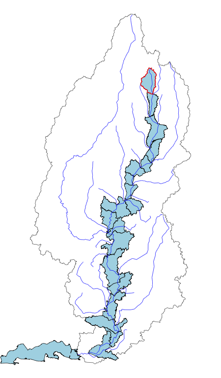

# HU12 NHDPlusV2 NHDPlus HiRes Matching

This repository holds work in progress code meant to match NHDPlus and Watershed Boundary Dataset networks to each other. It is being shared for access with colleagues only. It is preliminary and subject to revision.

  

  

# Disclaimer

This information is preliminary or provisional and is subject to revision. It is being provided to meet the need for timely best science. The information has not received final approval by the U.S. Geological Survey (USGS) and is provided on the condition that neither the USGS nor the U.S. Government shall be held liable for any damages resulting from the authorized or unauthorized use of the information.  

This software is in the public domain because it contains materials that originally came from the U.S. Geological Survey (USGS), an agency of the United States Department of Interior. For more information, see the official USGS copyright policy at https://www.usgs.gov/visual-id/credit_usgs.html#copyright  

Although this software program has been used by the USGS, no warranty, expressed or implied, is made by the USGS or the U.S. Government as to the accuracy and functioning of the program and related program material nor shall the fact of distribution constitute any such warranty, and no responsibility is assumed by the USGS in connection therewith.
This software is provided "AS IS."

# Project Layout

This project is designed around the `drake` workflow "_runner" scripts and uses the RStudio project scheme. The runner scripts source files in the `R` directory which in turn load all required packages. There is a R package in the `mainstems` directory that has rigorously tested functions that do the "heavy lifting" of the included workflows.

### `data`

The `data` folder contains all web-retrievable data required for the workflows. It is not checked in to the repository and may, for example, be symbolically linked to a system data store directory.

### `docs`

Used for gif and html resources that are hosted via GitHub pages.

### `hu12_fixes`

Contains over-ride fixes to be applied to the WBD "TOHUC" coding.

### `img`

Contains images that are included in the README.md file.

### `mainstems`

### `out`

All output is written here. It is not included in the repository.

### `R`

All un-tested ad-hoc R scripts are included here. These are primarily data-ETL and visualization. An effort has been made to move all consequential code to `mainstems` and other packages.

# License

Unless otherwise noted, This project is in the public domain in the United
States because it contains materials that originally came from the United
States Geological Survey, an agency of the United States Department of
Interior. For more information, see the official USGS copyright policy at
https://www2.usgs.gov/visual-id/credit_usgs.html#copyright

Additionally, we waive copyright and related rights in the work
worldwide through the CC0 1.0 Universal public domain dedication.

CC0 1.0 Universal Summary
-------------------------

This is a human-readable summary of the
[Legal Code (read the full text)][1].

### No Copyright

The person who associated a work with this deed has dedicated the work to
the public domain by waiving all of his or her rights to the work worldwide
under copyright law, including all related and neighboring rights, to the
extent allowed by law.

You can copy, modify, distribute and perform the work, even for commercial
purposes, all without asking permission.

### Other Information

In no way are the patent or trademark rights of any person affected by CC0,
nor are the rights that other persons may have in the work or in how the
work is used, such as publicity or privacy rights.

Unless expressly stated otherwise, the person who associated a work with
this deed makes no warranties about the work, and disclaims liability for
all uses of the work, to the fullest extent permitted by applicable law.
When using or citing the work, you should not imply endorsement by the
author or the affirmer.

[1]: https://creativecommons.org/publicdomain/zero/1.0/legalcode
